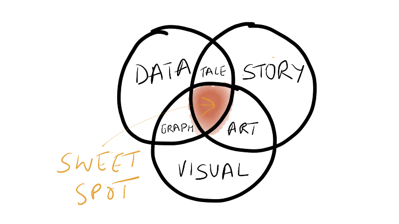

# Crafting Visual Stories with Data

> *"The ability to take data—to be able to understand it, to process it, to extract value from it, to visualize it, to communicate it—that’s going to be a hugely important skill in the next decades... Because now we really do have essentially free and ubiquitous data. So the complimentary scarce factor is the ability to understand that data and extract value from it." - Hal Varian, Google's chief economist*

> *"I think people have begun to forget how powerful human stories are, ex-changing their sense of empathy for a fetishistic fascination with data, networks, patterns, and total information... Really, the data is just part of the story. The human stuff is the main stuff, and the data should enrich it." - Jonathan Harris, artist and computer scientist*

The ever increasing computational capacity has enabled us to acquire, process and analyze larger data-sets and information. However, the human memory and attention required to use this data is more limited and has remained relatively constant. Data visualization and storytelling can enable us to compress data and encode them in ways to aid perceptual, cognitive and emotional capacity required to comprehend, retain and make decisions using this data. It enables us to move from analysis to synthesis, from numbers to visuals, and from an argument to a story. Operating at this intersection of data, visual and story (figure 1) will help persuade not only through logos (logic) but also through pathos (empathy) and ethos (credibility). In trying to tell compelling data-visual-story, we can empower our selves to engage, communicate and persuade a larger and diverse audience. 

Crafting visual stories with data is a cross disciplinary activity that requires us to operate at the intersection of a visual designer, coder, statistician, and storyteller. It is both a science and an art. The science involves learning the principles of graphic design, visual art, perceptual psychology, and cognitive science to better understand how our eyes, ears and brains can process inputs in an effective, efficient and accurate manner. The art involves exploring creative and innovative ways to create compelling data-visual-stories that appeal and engage at an emotional and aesthetic level.

## Objectives

The aim of the workshop is to provide a thorough introduction to the craft of data-visual-story. The focus will be to lay a strong foundation for your own journey of creating compelling data-visual-story. It will make you think and reflect by challenging some of your existing design approaches and perceptions about data visualization and storytelling. There are three key objectives: 

* To gain an instinctive appreciation of compelling data-visual-story through exemplars, and understand what works and how it works.
* To provide the knowledge of the basic building blocks needed for creating a data-visual-story as well as a flexible design framework to help guide your journey in creating them.
* To start learning the craft of creating data-visual-story through practice, presentation and feedback in an interactive workshop environment.

## Workshop Design

The workshop would be scheduled over two days and would be delivered with a mix of teaching, discussion and reflections, as well as individual and group exercises. Shorter version for one-day or half-day can be customized based on specific requirements or needs. It would aim to cover the following topics. 

* **Introduction and Fundamentals**
	- Understand value and types of visualization & stories 
	- *Exercise* - Conduct instinctive design critique + Review
	- Approach and design framework for creating data-visual-story
	- Understand data and image models
	- *Exercise* - Create a visualisation + Review
* **See the Data**
	- Acquire, prepare and refine the data for exploration
	- Conduct exploratory data visualization to find the data abstraction
	- *Exercise* - Explore a data-set visually + Review
* **Show the Visual**
	- Principles of graphical perception and integrity
	- Understand white space, data-ink, and chart junk
	- *Exercise* - Re-design a data chart + Review
	- Select appropriate visual representation e.g. graphs 
	- Effective use of color and animation
	- *Exercise* - Create an effective chart + Review 
* **Tell the Story**
	- Principles of storytelling 
	- Lessons on how stories work from other mediums
	- Selection of messaging - text annotation and verbal
	- *Exercise* - Tell your story + Review
	- Building a story flow - framing, transitions and archetypes
* **Engage the Audience**
	- Engagement in context - personal, presentation & participation 
	- Adding interactivity to the design.
	- *Exercise* - Presenting your data-visual-story + Review
* **Conclusion**
	- Takeaway principles of compelling data-visual-story
	- Wrap up and feedback

## Workshop Details
**Participant Profile** — The workshop is ideal for anyone who is interested in learning the art and craft of visualizing data and communicating persuasively through stories. You could be working with large and complex data-sets as an analyst or using a small datasets to create simple charts and slides in your presentation as a manager. There are no pre-requisite skills, knowledge or roles necessary for attending the workshop. Only an open approach to learning through listening, observation, and participation in the workshop activities and discussion is required.

**Number of Participants** —  The maximum number of participants for the workshop would be capped at 30. The small class size would enable a more participative environment with group interaction and presentations possible as well as opportunities to have one-to-one learning interactions. 

**Duration** — The workshop would be conducted over 2 days from 0900 to 1700. There will be short breaks during the morning and afternoon session and a longer lunch break of around 45 minutes in the middle.	

**Venue Logistics** — A training venue for the workshop, with availability of a projector, sound system and whiteboard would be needed for conducting the session.

**Workshop Cost** — The workshop would be charged at Rs. 75,000 per day (for Indian locations) or USD 3,000 per day (for International locations). Service tax and other government charges as applicable will be additional. Also, for sessions conducted outside of Bangalore, the facilitator's travel and accommodation cost would be charged on actuals.
 
**Facilitation** — Amit Kapoor, Founder, narrativeVIZ Consulting will facilitate the two-day workshop. 

## Facilitator's Profile
Amit Kapoor is interested in learning and teaching the craft of telling visual stories with data. He uses storytelling and data visualization as tools for improving communication, persuasion and leadership. He conducts workshops and trainings for corporates, non-profits, colleges, and individuals at narrativeVIZ Consulting. He also teaches storytelling with data as guest faculty in executive courses at IIM Bangalore and IIM Ahmedabad. 

His background is in strategy consulting in using data-driven stories to drive change across organizations and businesses. He has more than 12 years of management consulting experience, first with AT Kearney in India, then with Booz & Company in Europe and more recently for startups in Bangalore. He did his B.Tech in Mechanical Engineering from IIT, Delhi and PGDM (MBA) from IIM, Ahmedabad. You can find more about him at [amitkaps](http://amitkaps.com) and tweet him at @amitkaps
